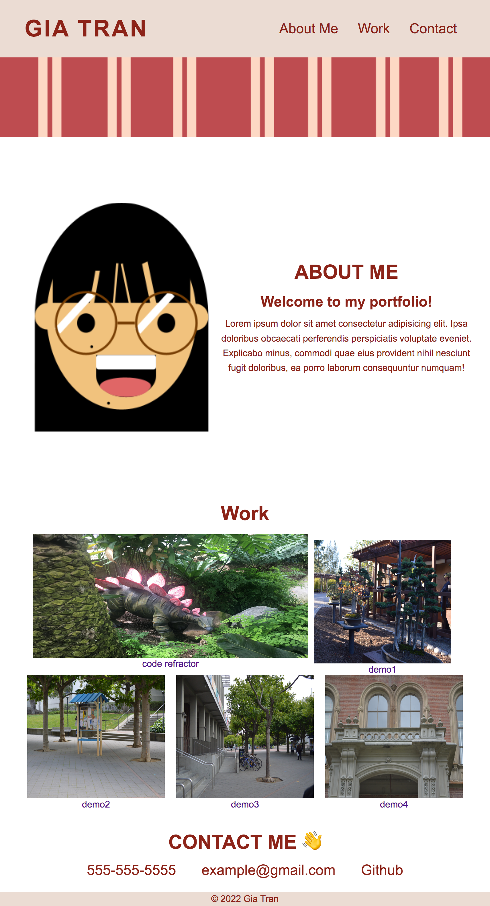

# Challenge2:Portfolio

## Description
For this project, I was nervous to code from scratch and make my own portfolio website.

This project challenged me on my knowledge of CSS and flexbox skills. Just when I thought I understood a concept for flexbox, working on this made me question my knowledge.

Looking at the project, I knew I would be able to start with basics HTML and CSS to get the skeleton of the project.

I immediately started working on three things:
* HTML semantics to create the skeleton of the website
* CSS universal elements I wanted in my website 
* Wireframing the portfolio website

Once I established the skeleton of the website, I started thinking about how I wanted the site to look like. I browsed through multiple examples and chose elements I liked and those which were doable for my skill-level.

Since the last challenge had a navigation bar, I decided to work on that section first. It was both fun and frustrating because I took so long deciding on the bar fonts and spacing .

I also surprised myself with how much I remembered and the different elements I used for this project. For example, using ```:root``` element for the two primary colors I switched between throughtout the challenge.

Overall, I was both frustrated and happy with this project. Working with flexbox and creating the cards for the "Work" section stressed me out because I tried multiple different ways to get to an okay spot in my project. Even though the flexbox cards aren't really nice to look at, I am really happy to complete the majority of it and from scratch too! 

## Usage
The navigation bar works to reach the different link section. The wider screen looks exactly how I want it to look. The only thing missing is the larger image for the first application. The smaller screen screen also looks good, except I realized the "work" section was not centered.




## Deployed Site
https://gt1222.github.io/Portfolio-demo/